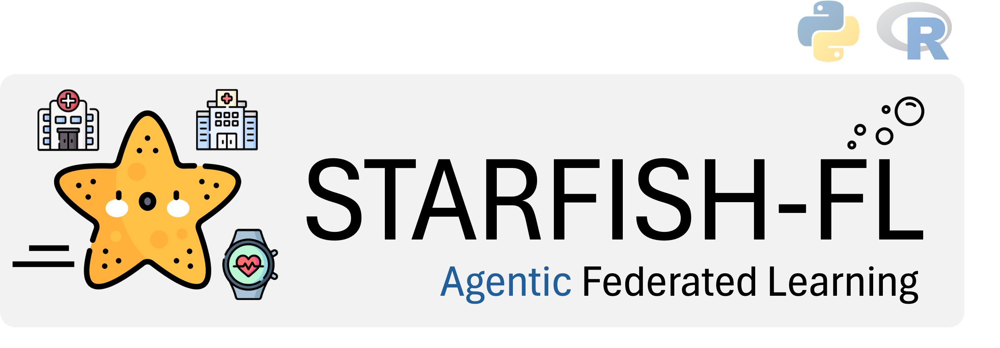
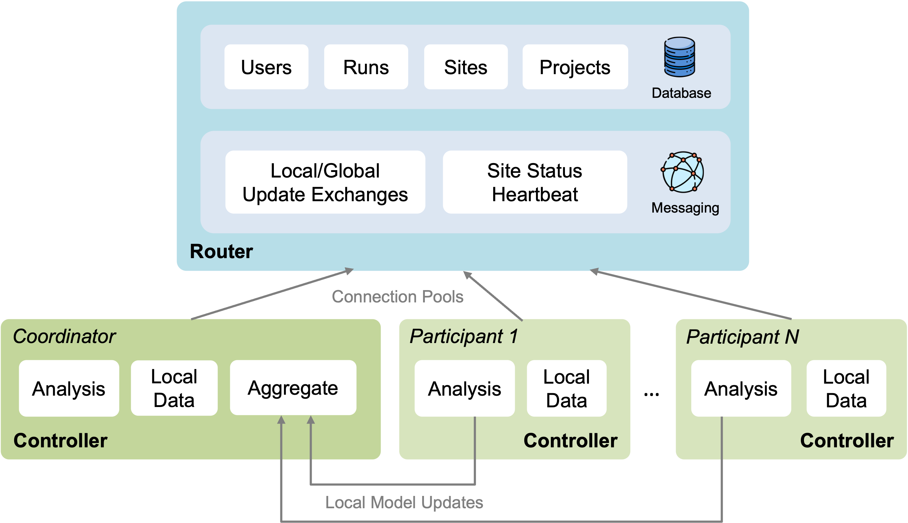

# An Agentic Federated Learning Framework



[](https://github.com/denoslab/starfish-fl/actions/workflows/controller-tests.yml)
[](https://github.com/denoslab/starfish-fl/actions/workflows/router-tests.yml)
[](https://github.com/denoslab/starfish-fl/actions/workflows/cli-agent-tests.yml)
[](https://github.com/denoslab/starfish-fl/actions/workflows/e2e-tests.yml)
[](LICENSE)
[](https://www.python.org/downloads/release/python-3100/)
[](https://www.r-project.org/)
[](https://www.djangoproject.com/)
[](https://www.docker.com/)

📖 **[Full API documentation](https://denoslab.github.io/starfish-fl/)**

Starfish-FL is an agentic federated learning (FL) framework that is native to AI agents. It is an essential component of the STARFISH project. It focuses on federated learning and analysis for the Analysis Mandate function of STARFISH.

Starfish-FL also offers a friendly user interface for easy use in domains including healthcare, computing resource allocation, and finance. Starfish-FL enables secure, privacy-preserving collaborative machine learning across multiple sites without centralizing sensitive data.

### Use Cases

**Biostatistics & Clinical Research** — Starfish-FL supports the methods biostatisticians use daily — logistic regression, Cox proportional hazards, Kaplan-Meier survival curves, Poisson and negative binomial models for count data, censored regression (Tobit) for detection-limit outcomes, MICE for missing data, and more — all federated out of the box with proper inverse-variance weighted meta-analysis and built-in diagnostics (VIF, residuals, goodness-of-fit tests). Every task is available in **both Python and R**, so researchers can work in their preferred language. Hospitals and research institutions can collaboratively build models on patient data without sharing sensitive records.

**Carbon-Aware Computing** — Starfish-FL enables predicting energy consumption and carbon footprints for containerized workloads across distributed infrastructure. By training regression models federally across edge and cloud sites, organizations can forecast resource energy demands and make carbon-conscious scheduling decisions — all without centralizing sensitive operational data. See our paper on [federated learning for carbon-aware container orchestration](https://arxiv.org/abs/2510.03970) for details.

## Overview

Starfish-FL is a complete federated learning platform consisting of three main components:

- **[Controller](controller/)** - Site management and FL task execution
- **[Router](router/)** - Central coordination and message routing
- **[CLI](cli/)** - Typer-based CLI (`starfish` command) for human and AI agent use, with built-in LLM agent for autonomous orchestration
- **[Workbench](workbench/)** - Development and testing environment

### Architecture

In this section, we use healthcare as an example how Starfish-FL can be used.



### Key Concepts

**Sites**: Local environments that can act as coordinators or participants in federated learning projects.

**Controllers**: Installed on each site to manage local training, model aggregation, and provide a web interface for users.

**Coordinators**: Sites that create and manage FL projects, orchestrate training rounds, and perform model aggregation.

**Participants**: Sites that join existing projects and contribute their local data to collaborative training.

**Router**: Central routing server that maintains global state, facilitates communication between sites, and forwards messages between participants and coordinators.

**Projects**: Define one or multiple FL tasks with specified coordinator and participants.

**Tasks**: Individual machine learning operations (e.g., LogisticRegression, CoxProportionalHazards, CensoredRegression, PoissonRegression) within a project. Tasks can be implemented in Python or R.

**Runs**: Execution instances of a project, allowing repeated training over time.

## Quick Start

### Prerequisites

- [Docker](https://docs.docker.com/engine/install/)
- [Docker Compose](https://docs.docker.com/compose/install/)

### Development Setup (All Components)

1. **Clone the repository**
   ```bash
   git clone https://github.com/denoslab/starfish-fl.git
   cd starfish-fl
   ```

2. **Start all services using Workbench**
   
   The workbench provides a complete development environment with all components:
   
   ```bash
   cd workbench
   make build
   make up
   ```

3. **Initialize the database** (first time only)
   ```bash
   ./init_db.sh
   ```

4. **Create superuser for router** (first time only)
   ```bash
   docker exec -it starfish-router poetry run python3 manage.py makemigrations
   docker exec -it starfish-router poetry run python3 manage.py migrate
   docker exec -it starfish-router poetry run python3 manage.py createsuperuser
   ```
   
   Make sure the username and password match what's configured in `workbench/config/controller.env`.

5. **Access the applications**
   - Router API: http://localhost:8000/starfish/api/v1/
   - Controller Web Interface: http://localhost:8001/

6. **Stop the services**
   ```bash
   make stop    # Stop services
   make down    # Stop and remove containers
   ```

## Component Documentation

### Controller

The Controller component is installed on each site participating in federated learning.

**Key Features:**
- Web-based user interface for project management
- Local model training and dataset management
- Support for 20 ML tasks across Python and R (regression, classification, survival analysis, censored regression, count data models, multiple imputation)
- Built-in model diagnostics (VIF, residual analysis, goodness-of-fit tests, prediction intervals)
- Real-time progress monitoring
- Celery-based distributed task processing

**Standalone Setup:**

See [controller/README.md](controller/README.md) for detailed installation and configuration.

**Quick Start:**
```bash
cd controller
docker-compose up -d
docker exec -it starfish-controller poetry run python3 manage.py migrate
```

Access at: http://localhost:8001/

### Router

The Router (Routing Server) maintains global state and coordinates communication between sites.

**Key Features:**
- RESTful API for site and project management
- Message forwarding between participants and coordinators
- Persistent storage for administrative data
- Support for end-to-end encryption
- Automated health checks via cron jobs
- Embedded LLM agent for adaptive aggregation, smart scheduling, and failure triage (opt-in per project)

**Standalone Setup:**

See [router/README.md](router/README.md) for detailed installation and configuration.

**Quick Start:**
```bash
cd router
docker-compose up -d
docker exec -it starfish-router poetry run python3 manage.py makemigrations
docker exec -it starfish-router poetry run python3 manage.py migrate
docker exec -it starfish-router poetry run python3 manage.py createsuperuser
```

Access at: http://localhost:8000/starfish/api/v1/

### Workbench

The Workbench provides a unified development and testing environment for the entire Starfish platform.

**Key Features:**
- Docker Compose orchestration for all components
- Unified configuration management
- Development utilities and scripts
- Makefile-based build system

**Documentation:**

See [workbench/README.md](workbench/README.md) for detailed usage.

**Commands:**
```bash
cd workbench
make build       # Build all services
make up          # Start all services
make stop        # Stop services
make down        # Stop and remove containers
```

## User Guides

- **[Controller User Guide](controller/USER_GUIDE.md)** - Comprehensive guide for using the Controller web interface
- **[Task Configuration Guide](controller/TASK_GUIDE.md)** - How to configure FL tasks and models
- **[CLI Agent Guide](cli/README.md#ai-agent)** - Using the AI agent for autonomous FL orchestration

## Development

### Technology Stack

- **Backend**: Python 3.10.10, Django
- **Task Queue**: Celery
- **Databases**: PostgreSQL (Router), SQLite (Controller)
- **Cache**: Redis
- **Python ML Libraries**: scikit-learn, NumPy, Pandas, statsmodels, scipy, lifelines
- **R Runtime**: R 4.x with `jsonlite`, `survival`, `mice`, `MASS`
- **Containerization**: Docker, Docker Compose

### Running Tests

**Router Tests:**
```bash
cd router
docker exec -it starfish-router poetry run python3 manage.py test
```

**Controller Tests:**
```bash
cd controller
docker exec -it starfish-controller poetry run python3 manage.py test
```

**CLI Agent Tests:**
```bash
cd cli
poetry install --extras agent
poetry run pytest tests/ -v
```

## Configuration

### Environment Variables

Each component uses environment files for configuration:

- **Controller**: `controller/.env` or `workbench/config/controller.env`
- **Router**: `router/.env` or `workbench/config/router.env`

**Key configuration options:**

Controller:
- `SITE_UID`: Unique identifier for the site
- `ROUTER_URL`: URL of the routing server
- `ROUTER_USERNAME`: Authentication credentials
- `ROUTER_PASSWORD`: Authentication credentials
- `CELERY_BROKER_URL`: Redis connection for Celery
- `REDIS_HOST`: Redis host for caching

Router:
- `DATABASE_HOST`: PostgreSQL host
- `POSTGRES_DB`: Database name
- `POSTGRES_USER`: Database username
- `POSTGRES_PASSWORD`: Database password
- `SECRET_KEY`: Django secret key

## Supported ML Tasks

Every task below is available in **both Python and R** (where noted), so researchers and data scientists can work in whichever language they prefer.

### Classification & Regression
| Task | Python | R | Description |
|------|:------:|:-:|-------------|
| Logistic Regression | `LogisticRegression` | `RLogisticRegression` | Binary classification with standard logistic regression |
| Statistical Logistic Regression | `LogisticRegressionStats` | — | Binary classification with statistical inference (coefficients, p-values, CI, odds ratios) |
| Linear Regression | `LinearRegression` | — | Continuous value prediction |
| SVM Regression | `SvmRegression` | — | Support Vector Machine regression |
| ANCOVA | `Ancova` | — | Analysis of Covariance for group comparisons controlling for covariates |
| Ordinal Logistic Regression | `OrdinalLogisticRegression` | — | Proportional odds model for ordered categorical outcomes |
| Mixed Effects Logistic Regression | `MixedEffectsLogisticRegression` | — | Multilevel logistic regression for clustered/hierarchical binary data |

### Survival Analysis & Censored Outcomes
| Task | Python | R | Description |
|------|:------:|:-:|-------------|
| Cox Proportional Hazards | `CoxProportionalHazards` | `RCoxProportionalHazards` | Time-to-event regression with hazard ratios (`lifelines` / `survival::coxph`) |
| Kaplan-Meier | `KaplanMeier` | `RKaplanMeier` | Non-parametric survival estimation with log-rank test (`lifelines` / `survival::survfit`) |
| Censored Regression (Tobit) | `CensoredRegression` | `RCensoredRegression` | Tobit Type I model for continuous outcomes with left/right censoring (custom MLE / `survival::survreg`) |

### Count Data Models
| Task | Python | R | Description |
|------|:------:|:-:|-------------|
| Poisson Regression | `PoissonRegression` | `RPoissonRegression` | GLM for count data with rate ratios (`statsmodels` / `glm(family=poisson)`) |
| Negative Binomial Regression | `NegativeBinomialRegression` | `RNegativeBinomialRegression` | Overdispersed count data (`statsmodels` / `MASS::glm.nb`) |

### Missing Data
| Task | Python | R | Description |
|------|:------:|:-:|-------------|
| Multiple Imputation (MICE) | `MultipleImputation` | `RMultipleImputation` | Multiple imputation by chained equations with Rubin's rules (`sklearn` / `mice::mice`) |

### Image Segmentation
| Task | Python | R | Description |
|------|:------:|:-:|-------------|
| Federated UNet | `FederatedUNet` | — | Federated image segmentation using UNet with FedAvg aggregation |

### Cross-Cutting: Model Diagnostics
All regression tasks include built-in diagnostics in their output:
- VIF (multicollinearity), residual summaries, Cook's distance
- Shapiro-Wilk normality test, Hosmer-Lemeshow GOF, overdispersion test
- Schoenfeld residuals for Cox PH proportional hazards assumption
- Censoring summary and AIC/BIC for censored regression
- Confidence and prediction interval summaries

See [TASK_GUIDE.md](controller/TASK_GUIDE.md) for configuration details and diagnostic field reference.

## Security

- End-to-end encryption support for message payloads
- Secure private key exchange between sites
- Authentication required for router access
- Site-specific UIDs for identification
- No centralized data storage - data remains at local sites

## Contributing

Contributions are welcome! Please ensure:

1. Code follows existing style and conventions
2. Tests are included for new features
3. Documentation is updated as needed
4. Docker configurations are tested

## License

Apache 2.0

## Support

For issues, questions, or contributions:

1. Check component-specific README files
2. Review user guides and task documentation
3. Open an issue in the repository

## Citation

If you use Starfish in your research, please cite:

```
@software{starfish,
  title = {Starfish-FL: A Federated Learning System},
  author = {DENOS Lab},
  year = {2026},
  url = {https://github.com/denoslab/starfish-fl}
}
```
